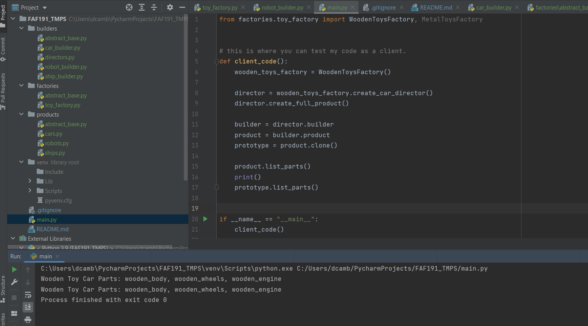

# FAF191_TMPS

## Author: `Cambur Dumitru`
## Topic: `Toy Builder Factory`
## Introduction/Theory:
    So, for this laboratory work we are going to create a toy factory!
    The idea behind the project is to create a factory
    where we can build the the different types of toys.
    The target is to create such a product, where if needed, we can construct 
    it by parts (to give an option of creating a custom product) and also,
    we can create a copy of it (for example, if we want to make more than one 
    unique product)
    
## Implementation/Explanation:
    *As all this work was written without any non-native python modules,
    you can simply run the project after configuring the enviroment.

    For this laboratory work I've decided to use 3 design patterns.
    1) Abstract Factory -> We will have wooden toys and metal toys.
    These will also be divided into cars, robots and ships. By default,
    our Concrete Factory will return the director class of a builder.

    2) Builder -> We will use it to create a product MVP/Full Version. 
    As cars, ships and robots will have different parts, we will have to create
    more than one builder. We will write the director class and put it into the
    Concrete Factory creation methods.

    3) Prototype -> this will be used to clone/copy an instance of our product,
    as we know that builder can result in unique products. For this one, 
    python built-in shallow copy function will be used. I decided to make a
    function in one of the two product abstract classes and force to write an 
    implementation of the clone() function, which stands for the prototype
    design pattern. 
    
    The workflow for client is next:
        1)create director -> use it to construct MVP/Full/Custom Product -> 
        get product instance from director's builder -> 
        list product parts to see what is added ->
        clone the product via clone() function -> 
        list prototype parts to see what is added.

    Existing functionality for client to work with:
        classes:
            WoodenToysFactory
            MetalToysFactory
        other:
            factory classes: create_<car/ship/robot>_director() method
            director classes: builder property, create_minimal_product()/create_full_product() methods
            builder classes: product property, for methods lookup in a builders/ folder
            products classes: add/list_parts/clone methods, for other methods lookup in a products/ folder
            

## Results
    After Working on this laboratory work, I can conclude that by using design 
    pattern the code becomes more simple to read and very flexible in modification.
    For instance, we can easily add/remove/modify a product/it's methods or
    do this with the builder without touching anything else other than the existing functionality.
    However, as a downside factory + builder pattern combo tends to grow quite fast (as each new product material
    will need much more than <product_number> of classes).
    You will obviously have to constantly look into factory -> builder -> product files,
    if you want to change something. 
    Any optimization made here will make the code less flexible, or less readable.
    
### Run Example

