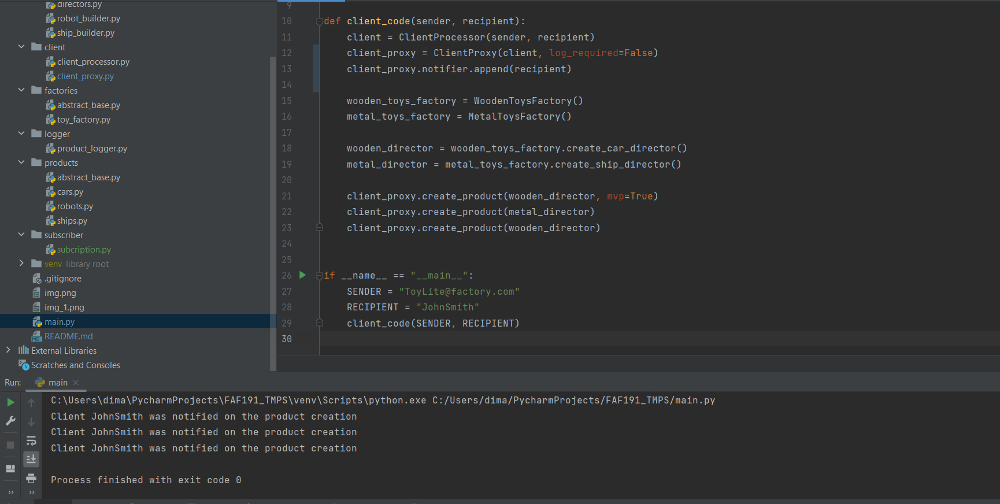

# Design Patterns


## Author: Cambur Dumitru

----

## Objectives:

* Get familiar with the DPs;
* Choose a specific domain;
* Implement at least 3 creational and structural DPs;
* Implement at least 1 Behavioral DP.


## Used Design Patterns: 

* Abstract Factory
* Prototype
* Builder
* Facade
* Decorator
* Proxy
* Observer


## Implementation

Let's build a toy factory! 
Abstract Factory is used to work with different toy factories.
Builder is used to make MVP and Full product versions by parts.
Prototype is used for mass-producing (if implementing this will ever be needed).

Facade is used to hide some initialization process 
from the client.
Decorator is used to create the logging logic.
Proxy is needed to combine logging logic with the product creation.

Observer is used to implement
notifications(via subscription model) for every product recipient 
(logger and notifications are different, 
as first are for the server side, last are for the clients ).
It is used in the client_proxy as the notifier object

### Snippets
#### Decorator
```
class ProductLogger:
    toys_created = 0

    def __init__(self, director):
        self.product = director.builder.product

    def switch(self, new_director):
        self.product = new_director.builder.product

    def log(self, send_from, send_to):
        self.toys_created += 1

        return {"from": send_from,
                "to": send_to,
                "msg": f"{self.product.factory_name}: the {self.product.type} "
                       f"toy was created at {datetime.datetime.now()} ",
                "toys_created": self.toys_created,
                "toys_parts": f"{self.product.parts}"}

```

#### Proxy
```
class ClientProxy:
    def __init__(self, real_client):
        self.real_client = real_client
        self.logger = None

    def __logger_init(self, director):
        if not self.logger:
            self.logger = ProductLogger(director)
        else:
            self.logger.switch(director)

    def create_product(self, director, mvp=False):
        self.__logger_init(director)
        product = self.real_client.create_product(director, mvp)
        print(self.logger.log(self.real_client.sender, self.real_client.recipient))

        return product
```

#### Facade
```
class ClientProcessor:
    def __init__(self, sender, recipient):
        self.sender = sender
        self.recipient = recipient

    @staticmethod
    def create_product(director, mvp=False):
        if not mvp:
            product = director.create_full_product()
        else:
            product = director.create_minimal_product()
        return product
```

#### Observer
```
class SubscribeObserver:
    def __init__(self):
        self.subscriptions = []

    def append(self, subscriber):
        if subscriber not in self.subscriptions:
            self.subscriptions.append(subscriber)
        else:
            print("Error: Subscriber Already Exists")

    def delete(self, subscriber):
        if subscriber in self.subscriptions:
            self.subscriptions.remove(subscriber)
        else:
            print("Error: Incorrect Subscriber")

    def notify(self):
        for subscriber in self.subscriptions:
            print(f"Client {subscriber} was notified on the product creation")

```

#### Working Screenshot



